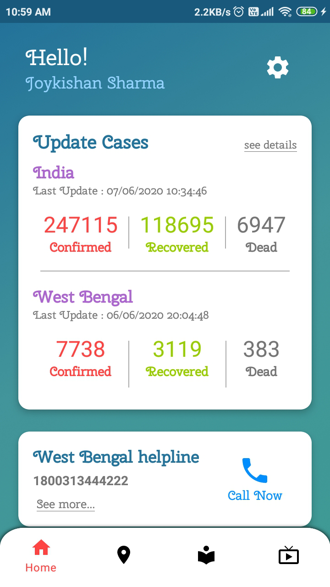
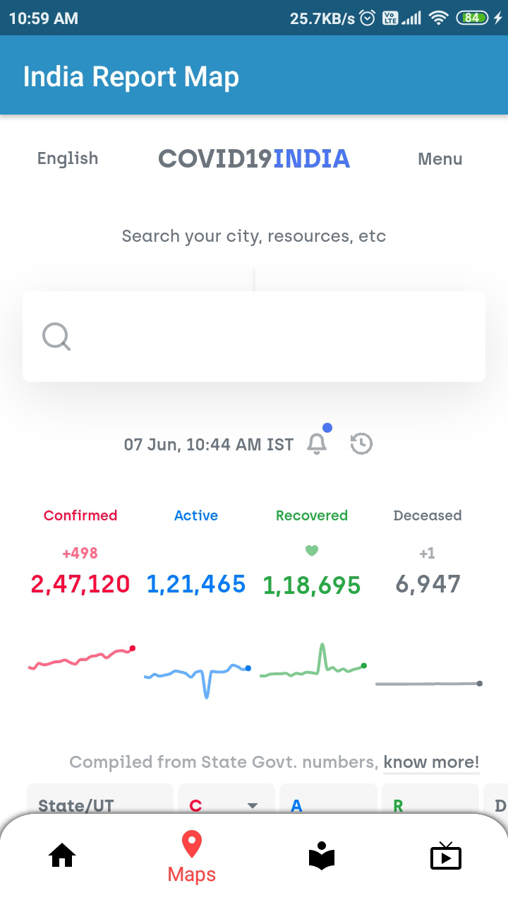
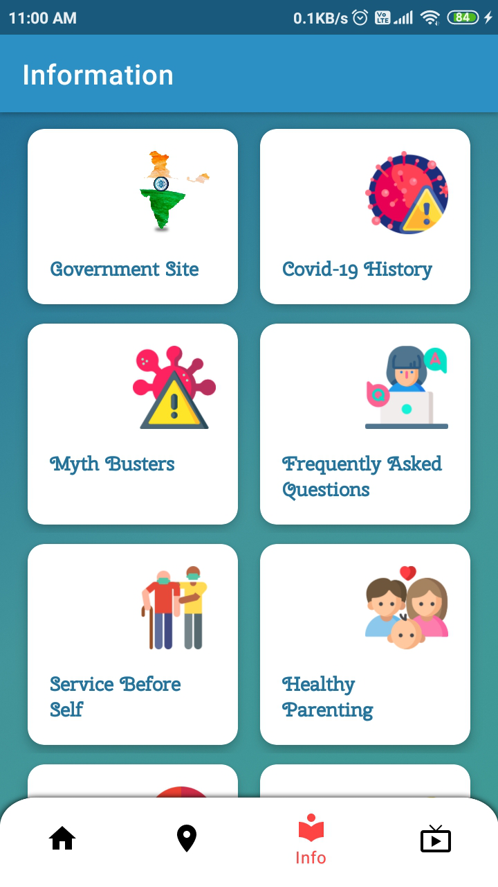
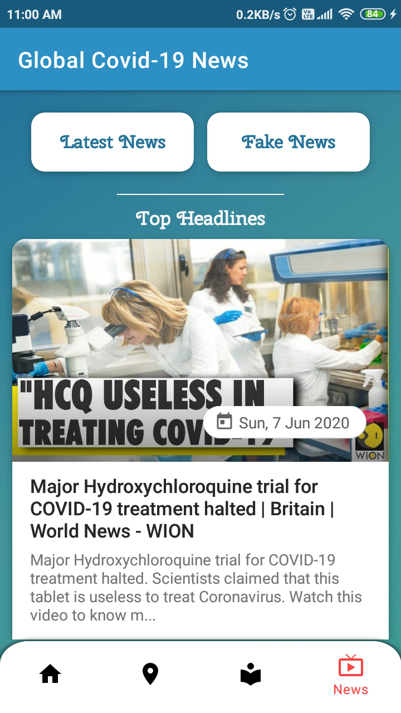

# Covid-19 Mobile Updater App
Covid-19 Mobile Updater App is a small and simple App designed and developed by Joykishan Sharma, a final year student for his Major Project. This Application was developed to fight against the misinformation and fake news spread during the sentitive moment of pandemic.

The information provided in this App may get outdated time to time, but I will try to keep it updated to the present knowledge as far as possible. 

## Covid-19 Mobile Updater App Download link 
[Click here to Download](https://drive.google.com/file/d/12zJT7fWdbtIFWEFtrdR__EGJ2AHQWcMA/view?usp=sharing)

## Getting Started
You would need to config these before running the app in Android Studio
* [Firebase Account](https://firebase.google.com/) (Email and Phone Authentication)
* [News API](https://newsapi.org/)
```java
public static final String API_KEY = "your_news_api_key_here";
```

## App Features 
* Real-time Covid-19 Case Updates ( India and user current State ).
* Direct Call to State Helpline ( on button click ).
* We also have the list of helpline numbers of all state in case user wants it.
* Briefly Explained the Symptoms and Preventions of Covid-19.
* Covid-19 Spread in India and World in Map view with Statistical and graphical representations.
* Covid-19 related info that a average User should know is also added in this App.
* Real-time News Feed from all over the World related to covid1-19 and healthcare.
* Latest News from India related to the covid-19.
* Verified Fake news for awareness.

## Few Screenshots
<table>
  <tr>
    <td>
      
    </td>
    <td>
      
    </td>
    <td>
      
    </td>
    <td>
      
    </td>
  </tr>
 </table>

## Why this App is not on PlayStore
PlayStore and AppleStore has suspended all the unauthorised Covid-19 related Apps from their platform to minimize the misinformation spread. They only allow App which are affiliated by Government or by any renowned Medical Institute. My App is not affiliated by Government or Medical Institutions.

## References and Attributions( Many Many thanks to them :-) )
* [COVID19-India](https://www.covid19india.org/)
* [News API](https://newsapi.org/)
* [Ministry of Health and Family Welfare, Government of India](https://www.mohfw.gov.in/)
* [World Health Organization](https://www.who.int/)
* [Wikipedia](https://en.wikipedia.org/wiki/Coronavirus)
* [Google Covid-19](https://www.google.com/intl/en_in/covid19/)
* [Google News](https://news.google.com/topics/CAAqIggKIhxDQkFTRHdvSkwyMHZNREZqY0hsNUVnSmxiaWdBUAE?hl=en-IN&gl=IN&ceid=IN%3Aen)
* [Alt News](https://www.altnews.in/)
* [freepik](https://www.freepik.com/)
* [unDraw](https://undraw.co/)
* [Flaticon](https://www.flaticon.com/)

## License
Covid-19-Tracer is released under the [MIT Lisense](https://github.com/JoykishanSharma/Covid-19-Tracer/blob/master/LICENSE)
